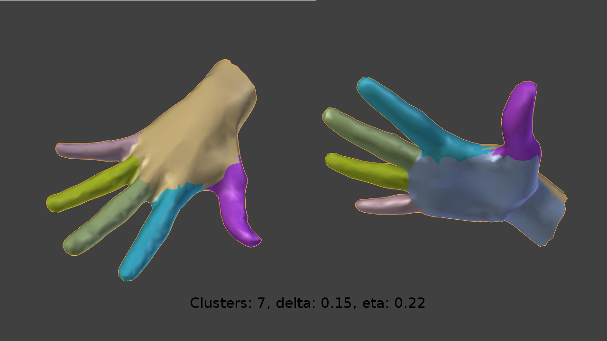

mesh_segmentation
=================

A simple python addon for blender using spectral clustering to segment meshes. Uses [numpy](http://www.numpy.org/) and [scipy](http://www.scipy.org/) for matrix calculations.
Developed as a project for the spectral-clustering course of University Bremen. Based on the paper "Segmentation of 3D Meshes through Spectral Clustering" by Rong Liu and Hao Zhang.
### Usage

 - [Install numpy and scipy](http://scipy.org/install.html). On Windows you will have to move the numpy and scipy folders to "YOUR_BLENDER_PATH/python/lib/site_packages" or "YOUR_BLENDER_PATH/python/scripts/modules"
 - Put the "mesh_segmentation" folder inside of "src" to "YOUR_BLENDER_PATH/python/scripts/addons"
 - Run Blender, go to "User Preferences -> Addons" and search for "mesh segmentation"
 - Activate the plugin by ticking the box at the right.

Now you can select an object in the 3D viewport, hit spacebar and search for "Segment Mesh". Clicking on that entry shows the addon in a popup.

You can find more examples in the example-results folder.
